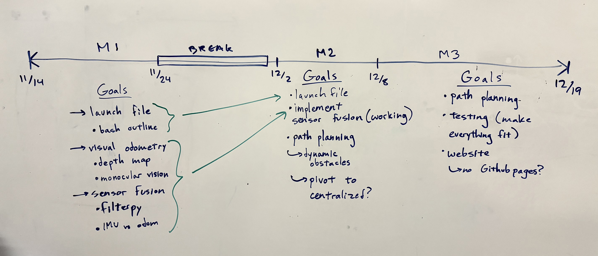
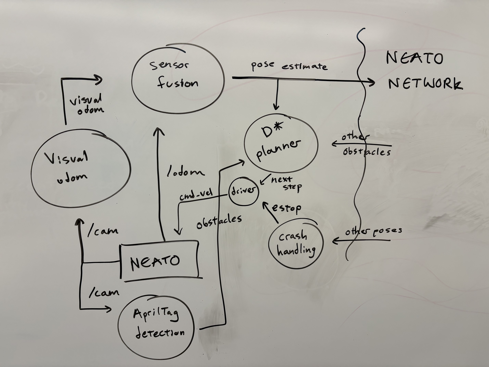
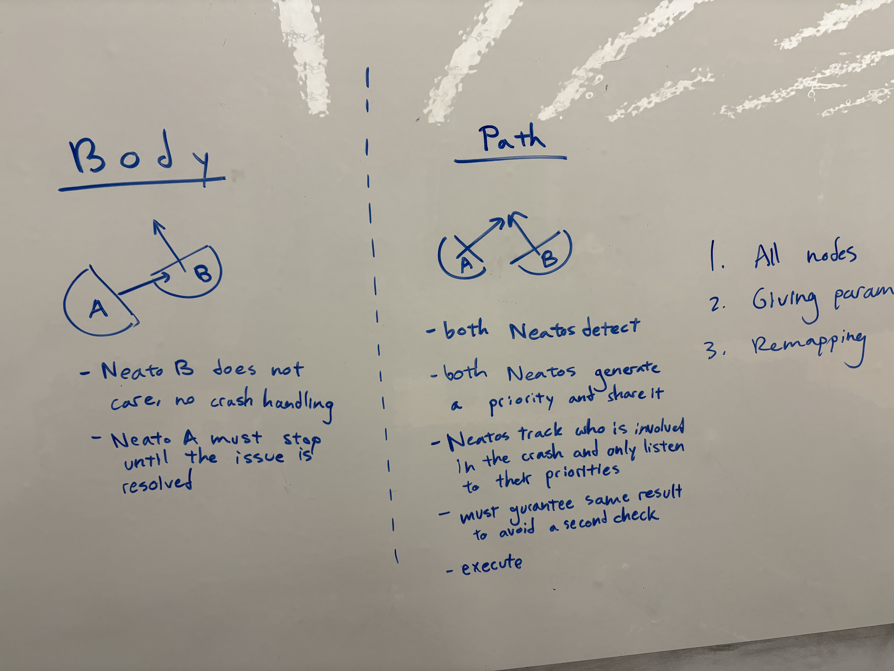
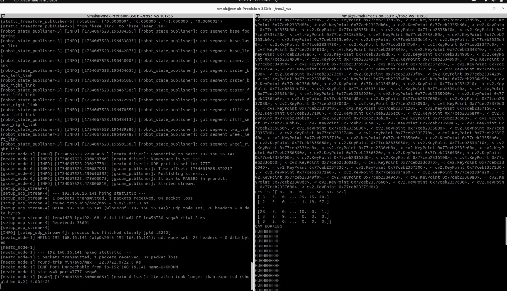

Image of our layout board, describing our timeline and our team goals for each sprint. 

---

Early image of our system layout plan. From this sketch we decided on the layout of system architecture. Notice that we did alter many things from this point in the process. For example, we pivoted away from using AprilTags soon after this picture was taken. 

---

Here is an image of how we started planning our crash handling node. We identified the two scenarios of physical crash and path intersection early on. 

---

Here is a screenshot of the terminal output from when the visual odometry started working. 

---

<iframe width="560" height="315" src="https://www.youtube.com/embed/Bg86EwJbDFg?si=9hwNZEqyxEdCUImp" title="Path Planning Fail" frameborder="0" allow="accelerometer; autoplay; clipboard-write; encrypted-media; gyroscope; picture-in-picture; web-share" referrerpolicy="strict-origin-when-cross-origin" allowfullscreen></iframe>

Above is a video of when we were testing a single robot path planning... As you can see it didn't turn out too well.

---

<iframe width="560" height="315" src="https://www.youtube.com/embed/Bg86EwJbDFg?si=eQSpmdEGzkr2ch7M" title="Path Planning Success" frameborder="0" allow="accelerometer; autoplay; clipboard-write; encrypted-media; gyroscope; picture-in-picture; web-share" referrerpolicy="strict-origin-when-cross-origin" allowfullscreen></iframe>

Here you can see the same objective as above, but this time the path planning worked!

---

<iframe width="560" height="315" src="https://www.youtube.com/embed/l7JHn1P49_8?si=OehTjw1A-3h-vr1p" title="1 Neato Path Plan w/ Obstacles" frameborder="0" allow="accelerometer; autoplay; clipboard-write; encrypted-media; gyroscope; picture-in-picture; web-share" referrerpolicy="strict-origin-when-cross-origin" allowfullscreen></iframe>

We added some obstacles (the red dots) and got that working.

---

<iframe width="560" height="315" src="https://www.youtube.com/embed/b3jujHLeyG4?si=YCrR0TemD_iCz__a" title="2 Neato Fail" frameborder="0" allow="accelerometer; autoplay; clipboard-write; encrypted-media; gyroscope; picture-in-picture; web-share" referrerpolicy="strict-origin-when-cross-origin" allowfullscreen></iframe>

Once we started working with multiple robots, it gave us a lot of trouble. 

---

<iframe width="560" height="315" src="https://www.youtube.com/embed/cGe1KRgT8iM?si=fNvShSsULMvcn-_W" title="Fleet Full Demo" frameborder="0" allow="accelerometer; autoplay; clipboard-write; encrypted-media; gyroscope; picture-in-picture; web-share" referrerpolicy="strict-origin-when-cross-origin" allowfullscreen></iframe>

Here is when we finally got the whole system working. 