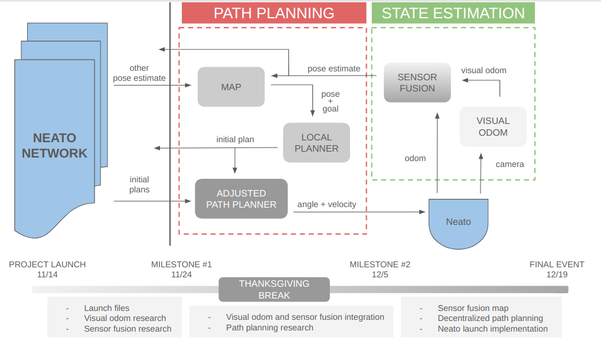

# Fleet Robotics
## Fall 2024: Intro to Computational Robotics Final Project
### Contributors: Ivy, Vivian, Ariel, Charlie

# Abstract
This project aims to develop and implement a control system for a fleet of mobile robots, leveraging sensor fusion techniques for autonomous navigation and collision avoidance. The system combines internal odometry data from Neato robots (using ROS 2) with visual odometry derived from embedded cameras. By fusing these two pose estimates, the robots can adjust their velocities to achieve more accurate localization and movement.

The final phase involves a demonstration of local path planning and inter-robot communication. Two Neato robots will start at a designated point at the start line and race to a pre-defined end point, initially following hard-coded paths designed to provoke a collision. A subsequent implementation, once each robot has updated the shared map with their predicted path, introduces an adjusted path planner. Each robot will then dynamically prioritize actions based on a hierarchy system, deciding whether to stop, wait, or replan its trajectory to avoid collisions while maintaining efficient navigation.

This work contributes to the study of autonomous robotic systems, highlighting the integration of sensor fusion, local path planning, and multi-agent communication for safe and coordinated fleet operations.

### Milestone 1

For our first milestone, we decided to map out the architecture of our software system. We developed the following system diagram to describe the node network of one Neato, including how we planned for it to communicate with itself and others:

We broke up our first sprint into three tasks: launching four Neatos with one file; implementing basic visual odometry on a set of images; and researching visual-inertial odometry via Kalman filtering. Notably, we are not examining the path-planning portion of this project until the next sprint.

#### Launching Multiple Neatos

An important part of our system is bringing up multiple robots at a time and making sure that their message-passing occurs within intentional namespaces, to avoid confusion. When examining the existing resources for launching multiple Neatos, we found that they

We initially created a ROS2 launch file that called the existing `bringup_multi.py` in the `neato_node2` package. However, we could not figure out how to pass the launch file a dynamic number of IP addresses using launch arguments. We considered passing all IP addresses in one argument and parsing them with a `split()`like function; however, we could not figure out how to do this.

Instead, we pivoted to using a shell script to bring up all our Neatos. Shell scripts will accept a nonconstant number of arguments, so as long as you are confident about what they will represent, you can use them. In our case, we wrote a shell script that accepted an argument for the number of Neatos to launch, and then that same number of IP addresses. The script uses these arguments to run `bringup_multi.py` as many times as was requested. This file is currently a draft that we plan to test after the break.

#### Simple Visual Odometry

- found an example to replicate
- did camera calibration
- realized we needed to generate a depth map (list options we are exploring to circumvent or solve this problem)

#### Exploring Sensor Fusion

We plan to implement visual-inertial odometry -- combine our robot's odometry-based pose estimates with visual odometry -- for highly accurate pose estimates. We think that this will require the use of a Kalman filter, which will allow continual visual updates to minimize the error in our native odometry. We found [this library](https://filterpy.readthedocs.io/en/latest/kalman/KalmanFilter.html), which simplifies the implementation of a Kalman filter.

One thing we need to consider is that Neato odometry is not the same as having inertial data from something like an IMU. We'll need to find more examples of how others have implemented visual-inertial odometry, but [this article](https://www.thinkautonomous.ai/blog/visual-inertial-odometry/) was a helpful first step, and made it seem like the regular Neato odometry would be just fine.

#### Next Steps

All in all, we met all of our sprint goals (though we did get snagged by the last-minute discovery about depth maps).

Our sprint goals for next week therefore remain generally unchanged: we want to get visual odometry wrapped in a ROS2 node that works with a live Neato, and we want to integrate that visual odometry data with Neato odometry data using a Kalman Filter to produce a high-quality pose estimate. Additionally, we want to spend significantly more time researching our options for path-planning and come to a final decision about whether or not we should pursue decentralized path-planning. Finally, we want to test our launching shell script on four real Neatos.