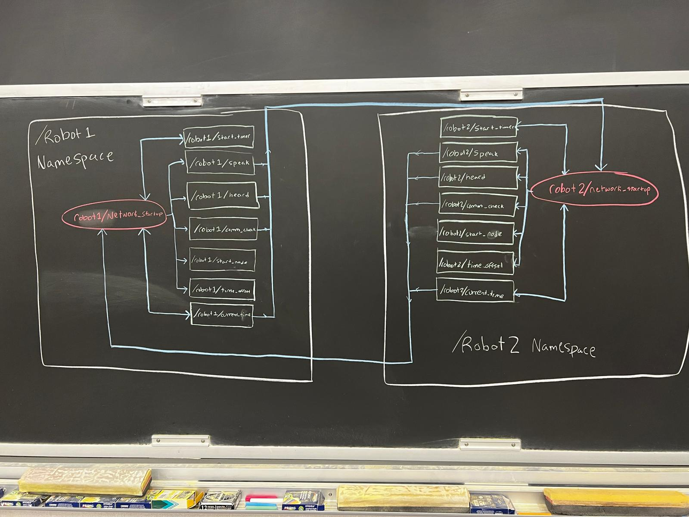

# Multi Neato Launch

## General

For this goal of the project, we have a few necesities:
- Launch multiple Neatos, specifically from one command
- Bring up all included ROS2 nodes
- Remap all topics to be robot-specific
- Confirm good communication between all Neatos
- Synchronize / figure out the difference between the 'local time' of each Neato

### Launching Multiple Neatos From One Command
To start this step, we first identified ways to bring up multiple Neatos that already exist.

Our most promising find was the `bringup_multi.py` launch file, a function in the Neato packages created at Olin. This file gives us a way to define all the standard ports used when bringing up 1 Neato, but we can run it multiple times to bring up as many Neatos as we want.

Given this file, we were able to call it in the bash file `fleet_launch.sh`, which serves as our input for the whole project. In this file, we take in command line inputs of `num_robots` - the number of robots, and `ips`, which is a list of all the ip addresses of the Neatos being used. by calling this script in the `fleet_robotics/bash_scripts` directory via a command like `./fleet_launch.sh 3 192.168.16.141 192.168.16.53 192.168.16.70` (the num robots and ips are just examples) we can bring up multiple robots.

One major issue we ran into was the order of bringing up Neatos. In a normal bringup, the act of bringing up a Neato blocks any more commands from running in the terminal. To get around this issue, we utilize the `&` symbol at the end of our bringup line. What this will do is launch all the Neatos as background processes. The issue with this method is that it is quite difficult to kill these processes after running the whole project. Since the nodes and topic are brought up in the background, using `crtl+c` to kill doesn't work. After lots of debugging, we couldn't quite figure out a way to kill these background without restarting our computers. So, this is one of our known bugs.

So, after deciding to settle with this background process issue, we finally added this line to the bash script:
```bash
(ros2 launch neato_node2 bringup_multi.py host:=$ip robot_name:=${robot_names[iter]} udp_video_port:=${video_ports[iter]} udp_sensor_port:=${sensor_ports[iter]} gscam_config:="${gscam_config}") &
```
Which passes in all the Neato port information, and critically uses the `&` symbol to bring them up in the background. 

### Bringing Up ROS2 Nodes

In order to bring up all of the nodes we wrote, we needed to create a ROS2 launch file. 

This launch file `fleet_member.launch.py` contains a few key parts that brings up the whole project. Firstly, we import information from our 2 config files, `fleet_info.yaml` and `map_config.yaml` both of which contain key information about the setup of our project that will dictate how we bring up the nodes. We then declar 2 launch arguments: which will be populated by the user when calling the launch file. These 2 arguments are the name of the robot, and the total number of robots. Once we have all this preliminary information, we can start building our nodes.

The layout of creating nodes is as follows:

```python
    {node_name} = Node(
            package="fleet_robotics",
            executable="{node_name}",
            parameters=[fleet_info, {"robot_name": robot_name}],
            namespace=robot_name,
        )
```
With this model of building a node, we can populate all of our nodes with their own specific information. After creating all our nodes, we then finally pass all of the information into our Launch Description, which actually brings up our nodes. 

To integrate this with our bash file, all we have to do is add one line to the bash script:
```bash
(ros2 launch fleet_robotics fleet_member.launch.py robot_name:=${robot_names[iter]} num_robots:=${num_bots}) &
```
which calls our launch file, passing in the arguments we created earlier. With this integrated into the bash file, our bash scripting is comepletely done.

### Remapping Topics

One major part of this project that we needed to figure out was how communication over topics works when we are using the same topic for different robots. For example, a common topic being used is `/cmd_vel`, which simply communicated to the Neato to move. However, When we have multiple robots, the `/cmd_vel` topic needs to be specific for each robot, so there isn't overlap of messages. To do this we need to 'remap' these topics. 

Wondering why we need to make a name for each Neato? It is so we can have an individualized 'namespace' for each robot! instead of publishing commands to `/cmd_vel`, we remap the topic to `/robot1/cmd_vel` (robot1 is changed for each robot). We define a namespace for each robot so that all the topics that are created on each robot are remapped to their own topic. 

Below is a simplified version of the `rqt_graph` depicting the nodes, topics, and namespaces involved in connecting robots together:




As you can see, this simplified graph shows all the topics (green squares) are being subscribed to in their own respective node (red oval), all of which fall under their own namespaces (big white square). The blue lines reprisent the connections between nodes and topics. For example, the `/robot1/current_time` topic is being published and subscribed to by the `robot1/network_handler` node, and being subscribed to by the `robot2/network_handler` node. This graph only shows the topics related to the `network_startup` node, but in our whole system, there are multiple nodes all interconnected in a graph like this. 

This graph also shows that the topics within a namespace are being remapped from `/topic_name` to `/robot_name/topic_name` which shows that we have successfully isolated our topics to be robot-specific. 

### Confirming Communications

The very first step of our project once our nodes start up is to make sure communication between all nodes is stable.

To do this, we create a series of Calls and Responses, where every robot will send out a message, and confirm that it has been heard by all the others. To do this, we make a series of publishers and subscribers, and have them all subscribe to each other. Below is the order-of-events for this process. For this process, lets imagine there are 3 robots. RobotX and RobotY are just a general name for any robot:

- All robots publish to `/speak` topic `"RobotX is Speaking"`
- All robots subscribed to `/speak` hear this message from all other robots
- All robots publish to `/heard` topic `"RobotX heard RobotY"`
- All robots confirm that they were heard by all other robots
- All robots publish to `/comm_check` topic `"Comms are good"`
- robot1 confirms that all Comms are good on every robot

Lets pause here, and talk about the next steps. Here, Robot1 has confirmation that every robot has good communication with every other robot. Now, moving on to the next step we need to start looking at the timers for every Neato.

### Timer Synchronization

One major problem with any decentralized fleet is that the 'local time' of each robot can be quite different. This time depends on when each robot starts their own personal timer. To account for this difference, we implemented a second portion of this network startup where they all start their timers, and share them with each other. To do this we have a few more steps in the process:

- robot1 publishes to `/start_timer` topic `"Start"`
- All robots subscribed to `/robot1/start_timer` hear this message, and initialize their timers
- All robots begin publishing their current time to the `/current_time` topic
- All robots subscribed to the `/current_time` topic save the times of all other robots at one timestep
- All robots calculate the difference between their time and the other robots
- All robots publish to the `/timer_offset` topic with the difference between their time and the other robots

With all of these steps, we have successfully found the time offset between all robots, a critical value that is used throughout other nodes to correctly plan their motion. 

### Other Notes

One interesting thing we had to do for this network startup to work was create our own message type. Specifically, we created a special `TimeSourced` message type, which contains a `String source_id`, `String msg_id`, and `Int32 nanosec`.
- `source_id` contains the name of the robot that sent the message
- `msg_id` contains a counter of how many messages it has sent
- `nanosec` contains a count of how many nanoseconds have passed since the initialization of the timer