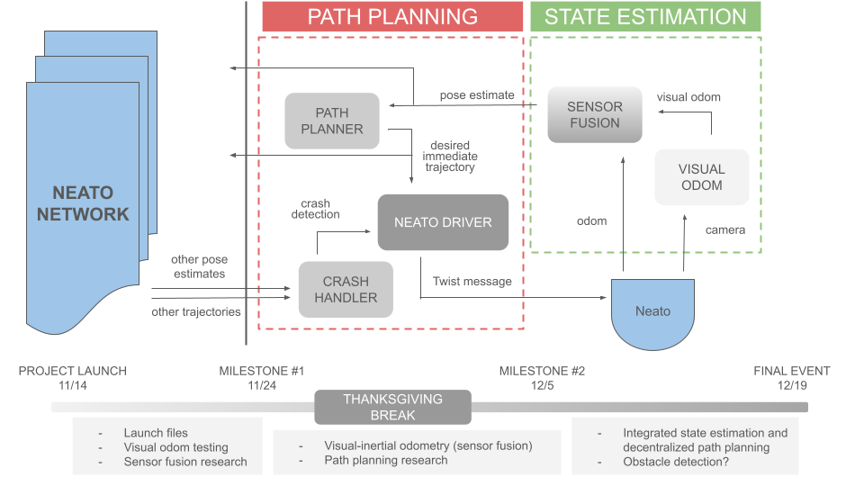

# Milestone 2

For our next milestone, we decided to dive deeper into the topics we initially worked on, as well as push into the path planning portion of the project.
We also updated the following system diagram to describe the node network of one Neato, including how we planned for it to communicate with itself and others

## Launching Multiple Neatos

For the last milestone, we pivoted to using a bash script to bring up out Neatos. In this sprint, we laid out and implemented the whole bash script. The script takes in arguments of [number_of_robots] [ip_adress_1] [ip_adress_2] [ip_adress_n]. This will take in the ips of all the Neatos being used. In the script, we create our own arguments that will be passed into the `bringup_multi.py` command, then run that command as many times as there are robots. 

During the implementation, we ran into a few problems. Most notably, the `bringup_multi.py` file essentially blocks any other commands to be run in the terminal used, which was a problem for us because we needed to run that file multiple times all in one terminal. To work around this, we altered the bash script to run the `bringup_multi.py` file as a background process, leaving the terminal open to us for use.

This solution caused another issue for us. When disconnecting from the Neatos, we normally just hit ctrl+c to close the process, but since the processes are in the background, we can not simply close them. Specifically, we are able to close the bash script, but the Neato nodes are still spinning, which stops us from reconnecting to them. To get around this problem, we wrote another bash script that searches for all processes that are related to the Neato nodes, and programatically kills them.

For the next sprint, we will start integrating this bash script with the other parts of the project. Specifically, we need to start up each node on each Neato individually. Our current plan for this is to write a launch file that uses a `robot_name` (which is dedicated to each of the Neatos in the bash script) that will remap the topics for each Neato. 

## Path Planning

After talking to the teaching team, we figured out a lot of design decisions in our system. We decided to take an online, decentralized approach to our path planning. This means that our algorithm will make plans in real-time and only plan for an individual Neato’s immediate next step. This will require all Neatos to share their current pose estimates as well as their desired next step. One potential challenge is aligning the timesteps of these poses and requests, to ensure Neatos are not using old information.

For the actual pathfinding algorithm, we initially decided on D* lite, but then because of the nature of our scenario (our map is going to be sparsely occupied with very few obstacles), we pivoted to using a straight path + obstacle avoidance algorithm. Neatos themselves will not be considered obstacles due to their dynamic nature; thus, interfleet crash handling is performed by a separate node.

The crash handling node defines two types of crashes: body crashes and path crashes. In body crashes, the local Neato identifies another Neato in its immediate path. The local Neato will never have right-of-way here and must wait for the other Neato to leave. In path crashes, the local Neato identifies another Neato’s trajectory in its immediate path. In this case, both Neatos will randomly determine who has right of way, confirm that they agree, and then act accordingly.

We aren’t confident that we’ll have time to implement any meaningful object detection, but if we do, our options are either AprilTags on static obstacles, or a combined LiDAR-Neato pose method. AprilTags is a classical approach and we could use this pre-existing package; however, the central downside is the complex frame transformation that comes with localizing the AprilTag onto the shared world map. LiDAR is tempting because we could filter out detected Neatos using the existing pose-sharing that is happening, and log everything else as an obstacle. The central challenge of using LiDAR, though, is probably the ability to group LiDAR points as discrete objects in a grid map.

## Visual Odometry

Having developed and implemented the high level code for visual odometry, this milestone was spent on debugging, optimizing data collection, and making a decision on how to estimate the motion between subsequent images with a single camera. 

With debugging, there were setup and hardware issues when trying to build the environment and connecting to the Neato, but now we are able to start debugging the actual code. For data collection, we had to choose what data to store to make sure we are not publishing the same pose even when a new image has not been received. Because technically all we need is two images, we decided to use a deque to keep track of our data.

During Milestone 1, the issue we ran into was not being able to estimate the pose between each subsequent image because the approach we tried requires a depth map which also requires a stereo camera. With this we realized we have to approach this with a monocular visual odometry pipeline as we didn't have multiple frames of the same pose. We decided to use an essential matrix decomposition to extract the rotation and translation from that. We also looked into optical flow, however this implementation was best for minimal changes within frames. So we decided to stick with using feature matching in case the time gap between frames is larger.
The final Monocular Visual Odometry pipelines is as follows:
- Image is received from the Neato
- Feature extraction
- Brute force feature matching and filtered by distance
- Estimate motion with essential matrix decomposition
- Publish a pose 

## Sensor Fusion

We evaluated our options for implementing sensor fusion and found the following options:
- Writing our own Extended Kalman Filter node, following this [article](https://automaticaddison.com/extended-kalman-filter-ekf-with-python-code-example/#Python_Code_for_the_Extended_Kalman_Filter)
- Utilizing the [filterpy library](https://filterpy.readthedocs.io/en/latest/kalman/ExtendedKalmanFilter.html) for Extended Kalman Filters
- Incorporating the ROS2 [robot_localization package](https://index.ros.org/p/robot_localization/), which performs sensor fusion for an arbitrary number of sensors

We decided to use the existing package for now and evaluate the quality of its pose estimation, because it was the fastest option to get up and running. When our visual odometry estimation is complete, we can quickly test it alongside this package and the Neato’s native odometry.

Depending on how Milestone 3 goes, we’d like to implement EKF ourselves, but until then this package allows us to move forward with our full state estimation system.
