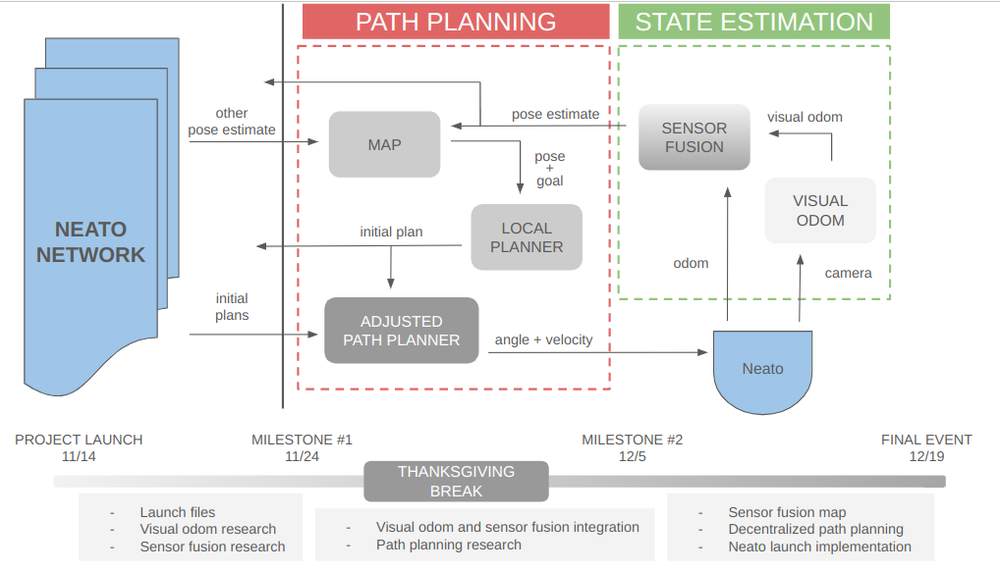
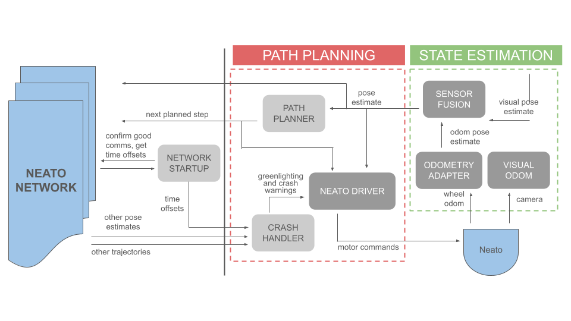
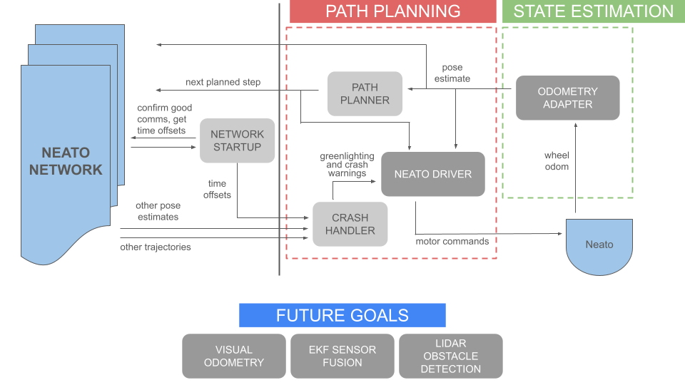

---
title: Progress
layout: default
filename: progress.md
--- 
# Progress Page

Our team was given four weeks to complete this sprint, which were themselves divided into three milestones. The first two milestones were given
one week each, while the last milestone was two weeks. To check out our progress for each milestone, view the subpages!

## Design Iteration
Our team was particularly interested in developing our skills for designing software architecture. Over the course of this project, we developed
several system diagrams that show off how our plan for the project changed over time. On this page, we show off the system diagram for each
sprint and explain how our plan evolved:

Our initial plan for the system. We envisioned having a node entirely dedicated to maintaining the local robot's internal map of the world. We intended
on developing a path planning node that made decisions without fleet information, with those decisions being corrected later by an "adjusted" path 
planner. However, we quickly realized that the flaw in this thinking was a possible infinite recursive loop -- what if the adjusted path planner needs
to be adjusted? What if two robots adjust their plans and create a new crash event? Therefore, we pivoted away from this plan.

During this sprint we did the brunt of our research into path planning, which is how we learned that a more proper form of doing this would be to have
an external crash handling node that essentially approves or vetos the path planner's suggestion based on fleetwide information. We also decided to
outsource the low-level control logic of getting the robot from Point A to Point B to a new "Neato Driver" node. However, we had not yet tackled the 
problem of inter-fleet comms and synchronization -- this challenge came next.

In the final iteration of our system, inter-fleet communication is much more fleshed out with a devoted "network startup node" confirming good comms
between every robot in the fleet, and also performing a timekeeping role in lieu of a more traditional time server. Time offsets are now communicated
to the crash handler, which can now choose to discard stale data. This complete system diagram demonstrates the ambition and complexity of our project.

## Demonstration System

Because we didn't get the chance to fully integrate our visual odometry or sensor fusion nodes into the project (we tested both extensively in isolation,
but simply ran out of time to integrate them with each other and the rest), we also created this "operating" diagram to show what was running on our
robots during the final demonstration day:

Here is a video of two robots in a fleet, each running this system locally while talking to each other:

<iframe width="560" height="315" src="https://www.youtube.com/embed/cGe1KRgT8iM?si=bJx4UclFSttoG1Ti" title="Fleet Working Demo" frameborder="0" allow="accelerometer; autoplay; clipboard-write; encrypted-media; gyroscope; picture-in-picture; web-share" referrerpolicy="strict-origin-when-cross-origin" allowfullscreen></iframe>