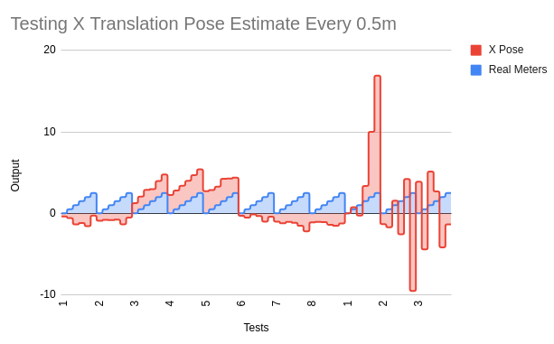
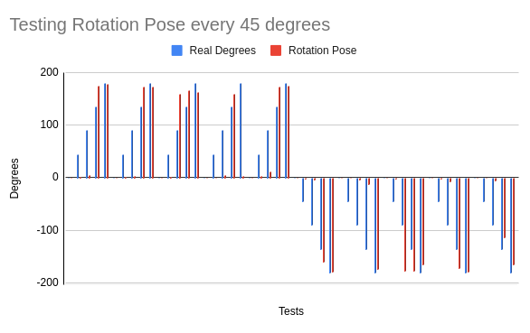

# Visual Odometry and Sensor Fusion

A decentralized path planning system requires fleet members to communicate where they are in the world with a very high degree of accuracy.
Because of this, our team investigated a significant amount of research and development time into the state estimation portion of this project.
We explored two main avenues: visual odometry for high-quality state estimation, and implementing a filter to smooth and fuse sensor data.

## Wheel Odometry

While our team was developing more complex state estimation software, we used the robot's native wheel odometry to construct rudimentary pose
estimates so that we could test our path planning. We developed a simple odometry adapter node that took the robot's latest odometry updates and
offset them by the robot's known starting position to transform them into the world frame.

During this time, we came to truly appreciate the important of managing sensor noise and drift with either sensor fusion or smoothing techniques.
Odometry, we found, has a tendency to accumulate error over time. This meant that by using odometry-based pose estimates, we were severely limiting
the physical distance our robot could traverse before it stopped being able to recognize when it had achieved a step or even a goal. Increasing
tolerance for error extended this lifetime at the cost of earlier inaccuracy, since a higher amount of error was acceptable.

All in all, while odometry-based state estimation was a useful stand-in for accurate state estimation, we would never use it in isolation for
any long-term state estimation. However, it could be a useful tool when paired with another sensor that provided intermediate, highly accurate
estimates, such as a GPS system or visual landmark detection.

## Monocular Visual Odometry

The goal of the Visual Odometry Node is to provide a pose estimate of the Neato through a singular camera mounted in the front. This data will feed into an extended kalman filter in the Sensor Fusion Node which combines internal odometry with the visual odometry to generate a more accurate pose estimate.

One of the biggest issues we ran into was creating depth maps for motion estimation. Depth maps require to sensors (usually a stereo camera) where the baseline distance is known, therefore being able to extract the depth. However with only one camera, we turned to the method of extracting a rotation and translation matrix from an essential matrix decompostiion. The finalized pipeline is as follows:

### MVO Pipeline
- Calibrate Neato camera to get the camera intrinsic matrix
- Image is received from the Neato every 1 second
- SIFT feature extraction
- FLANN-based feature matching and filtered good matches by distance
- Estimate motion with essential matrix decomposition
- Publish a pose 

### Calibration
Once this pipeline was able to produce a pose, the next step was to calibrate it on the actual Neato. One of the first problems we noticed was the inconsistency as it travels the positive x axis. Testing consisted of manually pushing the Neato 0.5m every 6 seconds and compared the recorded distance to the real distance. (A velocity of 0.083 m/s was just a magic number that worked the best with mathcing features between each frame.) 

Below is a graph showing the differnces in the outputed X pose (in red) compared to each 0.5m in real life (in blue). There was a huge inconsistency in the output scaling and positive/negative sign for each test which seemed very unrealiable.

The first 8 test we performed used `cv2.recoverPose()` to extract the rotation and translation. In the second set of tests, we tried directly implementing the single value decomposition math to extract the matrices. With the random spikes, we decided to continue with the OpenCV function. The next step to extracting out the correct translation is to compute the scale in each image. Using this function has a certain scale ambiguity that we cannot control.

The second set of calibration tests we performed was with the rotation matrix. Unlike the translation, this yielded very accurate results over time. In this calibration test, the real angle and computed angles were measured every 45 degrees going from 0 to 180 degrees clockwise and counter-clockwise. In the graph below, blue represents the manual movement of turning and the red is the output. The initial 45-90 degrees were very inaccurate as the estimation motion would always be significantly lower. However, as the Neato reaches 180 degrees, the angles would adjust to be more accurate, usually settling within 10 degrees.

### Concluding Thoughts

In the end, the pose estimate from monocular visual odometry was not implementing due to the inaccuracy and time constriants. Something that would be super helpful would be to create more visualizations of the differnt steps for easier debugging, ie drawing out the epipolar lines and using Rvis to show how the poses change.

## Sensor Fusion Via Extended Kalman Filter

We also explored the avenue of sensor fusion, i.e. combining using multiple sources of position data (visual odometry and wheel odometry, in our case)
to develop a highly accurate pose estimate overall. We first considered using the ROS2 robot_localization package, which runs an Extended Kalman Filter
under the hood to fuse an arbitrary amount of data from various sensors. However, we decided that it would be a great learning experience to write an
EKF node ourselves. We chose to use EKF rather than a standard Kalman Filter so that we could encorporate velocity data, which all types of odometry
are capable of providing but also transforms the system into a nonlinear model. While a Kalman Filter can only model a linear state, EKF includes a
first-order linearization step to expand its modelling capability.

We developed this node with the ability to take either wheel odometry or visual odometry, or both, and utilize them to continually improve the filter's
internal model of the world. We also developed a "pose plotter" node that listened to both odometry outputs and the EKF's pose model and compared the
outputted pose estimates. While we ran out of time to fully test the EKF node or integrate it with the rest of the system, writing the filter ourselves
was an immensely educational experience that deepened our understanding of the theory behind sensor fusion techniques.