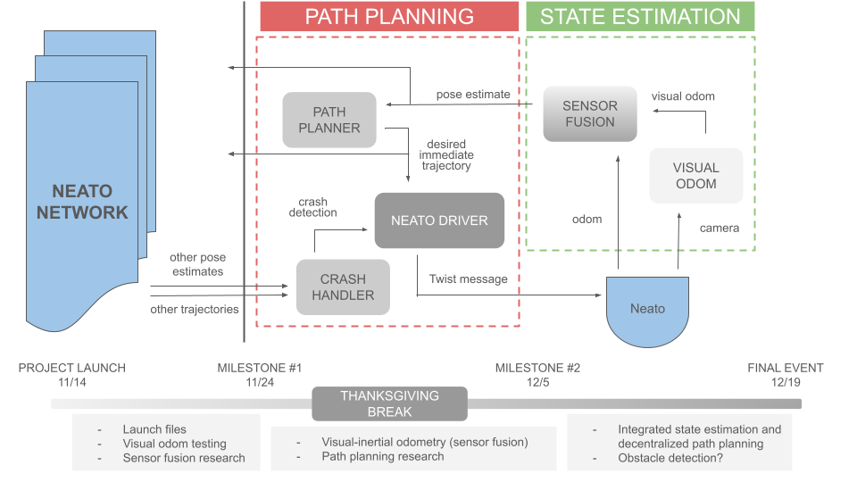

---
title: System
layout: default
filename: system.md
--- 
# System Overview

For the general outline of our system, We have a diagram that lays out the communication between sections

In this diagram, you can see that there are 2 main sections:
- Path Planning
    - Contains the path planner, Neato Driver, and crash handler
- State Estimation
    - Contains our sensor fusion and Visual odom

We also have the outside Neato network communicating into the crash handler, and getting commands from the sensor fusion and the path planner. We also have the physical Neato getting commands from the driver, and communicating to the components of the state estimation section. 

On the sidebar, in the dropdown under 'System', you will find the main components of the project. 
