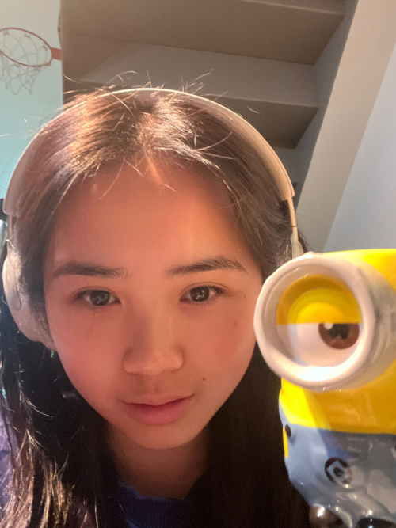
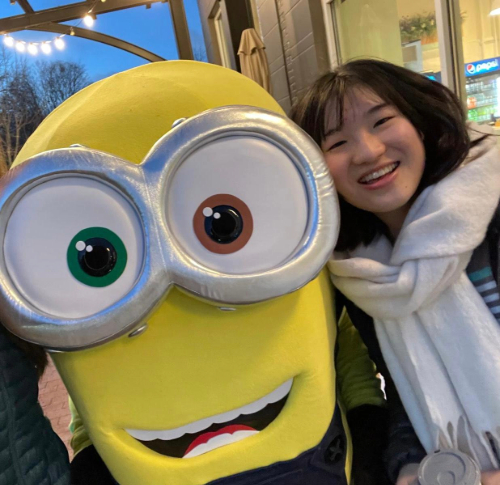

---
title: Team
layout: default
filename: team.md
--- 

# Meet the Team!

## Vivian Mak

### Learning Goals:
Understanding the entire control system at a high level, finding my own resources to dive deeply into a technical topic.
### I Worked On:
Monocular visual odometry!

## Charlie Mawn

### Learning Goals:
Expand my understanding of ROS2, especially with integrating launch files and nodes. Also, bash scripting!
### I Worked On:
The single-file launch system and the network startup node!

## Ariel Chen

### Learning Goals:
Learn to set up code architecture for a multi-robot system and become more proficient with ROS2.
### I Worked On:
All of our research and design decisions related to path planning, especially the trade-offs between centralized and decentralized path planning.

## Ivy Mahncke

### Learning Goals:
Dive deeply into sensor fusion and get the chance to implement an Extended Kalman Filter. Also, explore path planning in an applied context.
### I Worked On:
Design and logic behind the crash handling system, researching sensor fusion and EKFs, and performing the role of Project Manager!